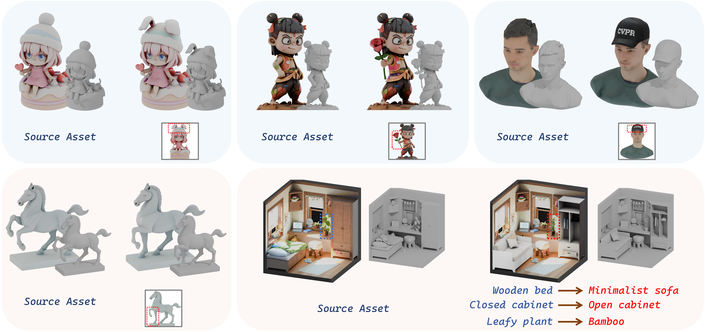

# Easy3E: Easy 3D Editing via FlowEdit 🎉 (Accepted to CVPR 2026!)

<p align="center">
  
</p>

<p align="center">
  <b>Given a source 3D model, a condition image, and a 3D mask, Easy3E produces a locally edited 3D asset.</b>
</p>

---

**Easy3E** is a 3D model editing pipeline built on top of [TRELLIS](https://github.com/Microsoft/TRELLIS). It enables localized, mask-guided editing of 3D assets using a two-stage workflow: **preprocess** → **edit**. Given a source 3D model, a user-painted condition image, and a 3D mask indicating the edit region, Easy3E produces an edited 3D model (`.glb`) with the desired modifications applied only within the masked area.

## 📋 Requirements

- **OS**: Linux (tested on Ubuntu 20.04+)
- **GPU**: NVIDIA GPU with ≥24GB VRAM (A100/A6000 recommended)
- **CUDA**: 11.8+
- **Python**: 3.10+
- **Blender**: 4.0.0 (for rendering; see installation below)

### Python Dependencies

```
torch >= 2.1.0
torchvision
open3d
numpy
Pillow
einops
tqdm
spconv-cu118  # or matching CUDA version
safetensors
easydict
utils3d
```

## 🚀 Installation

### 1. Clone the repository

```bash
git clone https://github.com/linchanyi/Easy3E.git
cd Easy3E
```

### 2. Create conda environment

```bash
conda create -n easy3e python=3.10 -y
conda activate easy3e
pip install torch torchvision --index-url https://download.pytorch.org/whl/cu118
pip install open3d numpy Pillow einops tqdm spconv-cu118 safetensors easydict utils3d
```

### 3. Build CUDA extensions

```bash
cd extensions/vox2seq
pip install .
cd ../..
```

### 4. Install Blender 4.0.0

```bash
mkdir -p tmp && cd tmp
wget https://download.blender.org/release/Blender4.0/blender-4.0.0-linux-x64.tar.xz
tar -xf blender-4.0.0-linux-x64.tar.xz
cd ..
```

Or set the `BLENDER_PATH` environment variable to point to your existing Blender installation:

```bash
export BLENDER_PATH=/path/to/blender
```

## 📁 Directory Structure

```
Easy3E/
├── inference.py              # Main CLI entry point
├── inference.sh              # Single-case edit script (example)
├── preprocess_batch.sh       # Batch preprocessing script
├── run.sh                    # Quick-start wrapper
├── pipeline_edit/            # Core pipeline package
│   ├── __init__.py
│   ├── edit.py               # Edit / baseline stage
│   ├── preprocess.py         # Preprocessing stage
│   └── utils.py              # Shared utilities
├── blender/                  # Blender rendering scripts
│   └── render.py             # Unified rendering script (multi-task)
├── trellis/                  # TRELLIS model library
├── extensions/               # CUDA extensions (vox2seq)
├── configs/                  # Model configuration files
├── checkpoint/               # Pretrained model weights
└── tmp/                      # Blender installation (not tracked by git)
```

### Data Directory Layout (per case)

```
<case_root>/
├── model/                    # Source 3D model (.glb / .obj / .ply)
├── render/                   # [Auto-generated] Preprocess artifacts
│   ├── mesh.ply              #   Normalized triangle mesh
│   ├── feature.npz           #   Per-voxel DINOv2 features
│   ├── transforms.json       #   Multi-view camera parameters
│   ├── ss_latent.pt          #   Cached SS encoder latent
│   └── slat_latent.pt        #   Cached SLAT encoder latent
├── edit_views/               # [Auto-generated] Orthographic reference views (16 images)
├── ori/012.png               # [Auto-generated] Reference image for edit stage
├── cond/                     # User-provided edit condition images (RGBA)
│   └── <edit_name>.png       #   Alpha channel = edit mask
├── mask/                     # User-provided 3D edit region masks
│   └── <edit_name>.glb       #   Must match cond filename
└── output/                   # [Auto-generated] Edit results
    └── <edit_name>.glb       #   Final edited 3D model
```

## 🔧 Usage

### Step 1: Preprocessing (run once per model)

Preprocess a single model:

```bash
python inference.py \
  --preprocess \
  --root_dir ./examples/tiger \
  --obj_path ./examples/tiger/model \
  --original_image ./examples/tiger/ori/012.png
```

Batch preprocess multiple models:

```bash
bash preprocess_batch.sh /path/to/your/models
```

### Step 2: Editing

Using the shell script (recommended):

```bash
# Edit inference.sh: set ID and BASE to your case
bash inference.sh
```

Using Python directly:

```bash
python inference.py \
  --input_dir ./examples/tiger/cond \
  --mask_dir ./examples/tiger/mask \
  --output_dir ./examples/tiger/output \
  --root_dir ./examples/tiger \
  --obj_path ./examples/tiger/model \
  --mode edit \
  --original_image ./examples/tiger/ori/012.png \
  --cfg_src 5.0 \
  --cfg_tar 5.0
```

### Baseline Mode (image-to-3D without editing)

```bash
python inference.py \
  --input_dir ./examples/tiger/cond \
  --output_dir ./examples/tiger/output \
  --mode baseline
```

## ⚙️ Parameters

| Parameter | Default | Description |
|-----------|---------|-------------|
| `--checkpoint` | `checkpoint/TRELLIS-image-large` | Pretrained model directory |
| `--mode` | `baseline` | Run mode: `baseline` \| `edit` |
| `--preprocess` | off | Run preprocessing only |
| `--seed` | 1 | Random seed |
| `--cfg_src` | 5.0 | Source condition CFG strength in FlowEdit |
| `--cfg_tar` | 5.0 | Target condition CFG strength in FlowEdit |
| `--enable_step_viz` | off | Export per-step visualization (slower) |
| `--no_guidance` | off | Disable orthographic silhouette guidance |
| `--no_gpu` | off | Disable GPU acceleration |

## 🔑 Environment Variables

| Variable | Description |
|----------|-------------|
| `BLENDER_PATH` | Override the default Blender executable path |
| `CUDA_VISIBLE_DEVICES` | Select GPU device(s) |
| `SPCONV_ALGO` | SpConv algorithm: `native` (default) or `auto` |

## 📝 How It Works

1. **Preprocessing**: The source 3D model is rendered from 150 viewpoints using Blender, voxelized to a 64³ grid, and per-voxel DINOv2 features are extracted. SS and SLAT latents are pre-computed and cached.

2. **Editing**: Given a user-painted condition image (RGBA, where alpha = edit mask) and a 3D mask mesh (`.glb`), the pipeline:
   - Extracts a 2D edit mask from the alpha channel
   - Constructs a 3D latent mask from the mask mesh via SDF/flood-fill
   - Runs FlowEdit with source/target CFG to produce the edited latent
   - Decodes the latent to Gaussian splats + mesh and exports as `.glb`

## 🙏 Acknowledgements

This project builds upon [TRELLIS](https://github.com/Microsoft/TRELLIS) — 3D asset generation via structured latents.

## 📄 License

This project is released under the [MIT License](LICENSE).

## 📖 Citation

If you find this work useful, please cite our CVPR 2026 paper:

```bibtex
@inproceedings{easy3e2026,
  title={Easy3E: Easy 3D Editing via FlowEdit},
  author={},
  booktitle={Proceedings of the IEEE/CVF Conference on Computer Vision and Pattern Recognition (CVPR)},
  year={2026}
}
```
